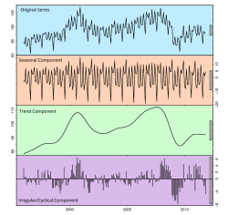

# LisansUstu
Lisanüstü çalışmalar için yol gösterici kaynaklar

## Faydalı Youtube Kanalları

### Türkçe Ders Videoları
- [BMDerslerim]
- [Şadi Evren Şeker]
- [Caner Erden]
- [Dr. Erkan AĞASLAN]
- [malumath]
- [çağatay odabaşı]
- [Ozkan Yilmaz]
- [Tirendaz Akademi]
- [Makine Ogrenmesi]
- [Mehmet İşcan]

### Python ve makine öğrenmesi kursları

- [Murat Karakaya Akademi]
- [Patric Loeber]
- [DigitalSreeni]
- [Rob Mulla]    
- [Edureka!]
- [Greg Hogg]
- [Venelin Valkov]
- [pyData]
- [StatQuest with Josh Starmer]
- [Tübingen Machine Learning]
- [Shusen Wang]
- [Halfling Wizard]
- [The AI Guy]
- [TheCodingBug]
- [DeepLearning004]
- [Machine Learning University]
- [Aladdin Persson]
- [Machine Learning Interview]
- [mildlyoverfitted]
- [Connor Shorten]
- [Time Series in R]
- [Dr. Bharatendra Rai]
- [AIEngineering]
- [ritvikmath]

### Yapay Zeka Uygulamaları
- [Yapay Zeka İle Hisse Analizi]

### Zaman Serisi Analizleri

- [How to Develop LSTM Models for Time Series Forecasting]
- [Stock Price Prediction using LSTM, FBProphet and ARIMA Model]
- [Multivariate Imputation by Chained Equations]
- [Machine Learning For Finance]
- [BRITS: Bidirectional Recurrent Imputation for Time Series]
- [Financial Machine Learning]
- [Correlation Prediction with ARIMA-LSTM Hybrid Model]
- [Stock Price Prediction of Apple Inc. Using Recurrent Neural Network]
- [Hybrid ARIMA-LSTM model]
- [Time Series Forecasting ARIMA vs LSTM-RNN]
- [Understanding LSTM Networks]
- [Applied Time Series]
- [Time Series Forecasting Using Python]
- [Complete Guide on Time Series Analysis in Python]
- [Darts: Time Series Made Easy in Python]
- [GluonTS - Probabilistic Time Series Modeling in Python]
- [Modern Aspects of Big Time Series Forecasting]
- [A Gentle Introduction to Autocorrelation and Partial Autocorrelation]
- [A Gentle Introduction to Handling a Non-Stationary Time Series in Python]
- [Deep Learning Models for Univariate Time Series Forecasting]
- [Developing Forecast Models from Time-Series Data in MATLAB]

### Anomali Tespiti
- [Time Series Anomaly Detection with LSTM Autoencoders using Keras & TensorFlow 2 in Python]

### İstatistik dersleri ve R uygulamaları

- [Sosyal Bilimler R Platformu]
- [Zaman Serisi Nedir? R ile Zaman Serisi Analizine Giriş]
- [R ile Zaman Serileri Analizi]
- [Hands-On Machine Learning with R]
- [A Gentle Introduction to Time Series Analysis & Forecasting]
- [MarinStatsLectures-R Programming & Statistics]
- [Introduction to Econometrics with R]
- [Jamovi]
- [LSTM TIME SERIES PREDICTION IN R]
- [r-statistics.co]
- [R - Multiple Regression]
- [R Üzerinde Zaman Serisi Analizi]
- [Interest Rate Times Series Forecast Using LSTM Neural Network]
- [Time series forecasting - with deep learning]
- [An introduction to weather forecasting with deep learning]
- [Time Series Forecasting with Recurrent Neural Networks]
- [Time Series Analysis using R: Tutorial]
- [Time Series Deep Learning: Forecasting Sunspots With Keras Stateful LSTM In R]
- [Time Series Forecasting using LSTM in R]
- [Using R for Time Series Analysis]
- [Introduction of Panel Data]
- [Recurrent Neural Network (RNN) in R]
- [Granger Causality, Impulse Response, Variance Decomposition, and Forecasting in VAR using R]
- [Doing Meta-Analysis in R]
- [A Complete Tutorial on Time Series Modeling in R]
- [Machine Learning for Factor Investing]
- [Ensemble learning for time series forecasting in R]
- [Time Series Analysis of PM 2.5 Content in Beijing]
- [Forecasting: Principles and Practice 2nd Ed.]
- [A Complete Tutorial to learn Data Science in R from Scratch]

### Programlama
- [BTK Akademi]
- [Engin Demiroğ]
- [Dali n Code]
- [Fox Learn]
- [JamesQQuick]
- [DMK Data]

### Optimizasyon problemlerinin çözümü
- [Solving Optimization Problems]

### Sinyal İşleme
- [DrBennett]

### Elektronik
- [EETechStuff]
- [Shawn Hymel]

### Çeşitli matemetiksel yaklaşımların görselleştirildiği videolar 
- [Visually Explained]
- [3 blue 1 brown]
- [Physics Videos by Eugene Khutoryansky]

### Bilimsel Açıklama Videoları
- [Simply Explained]
- [Holosen]
- [Practical Engineering]
- [Animagraffs]

### Akademik Hayat
- [AkademikLink]
- [Metin Aytekin]
- [Oğuz Ergin]

### İngilizce Ders Videoları
- [Benim Hocam]

[Rob Mulla]: <https://www.youtube.com/@robmulla>
[Visually Explained]: <https://www.youtube.com/c/BachirElKhadir/videos>
[Edureka!]:<https://www.youtube.com/@edurekaIN>
[Patric Loeber]:<https://www.youtube.com/@patloeber >
[DigitalSreeni]:<https://www.youtube.com/@DigitalSreeni>
[Greg Hogg]:<https://www.youtube.com/@GregHogg>
[BMDerslerim]: <https://www.youtube.com/bmderslerim>
[Caner Erden]: <https://www.youtube.com/@CanerErden>
[Venelin Valkov]:<https://www.youtube.com/@venelin_valkov>
[pyData]:<https://www.youtube.com/@PyDataTV>
[StatQuest with Josh Starmer]:<https://www.youtube.com/@statquest>
[EETechStuff]:<https://www.youtube.com/@EETechStuff>
[Engin Demiroğ]:<https://www.youtube.com/@engindemirog2946>
[Dali n Code]:<https://www.youtube.com/@kesali>
[Shawn Hymel]:<https://www.youtube.com/@ShawnHymel>
[Fox Learn]:<https://www.youtube.com/@foxlearn>
[Dr. Erkan AĞASLAN]:<https://www.youtube.com/@DrErkanAGASLAN>
[Metin Aytekin]: <https://www.youtube.com/@metinaytekin>
[Simply Explained]:<https://www.youtube.com/@simplyexplained>
[JamesQQuick]:<https://www.youtube.com/@JamesQQuick>
[Tübingen Machine Learning]:<https://www.youtube.com/@TubingenML>
[Shusen Wang]: <https://www.youtube.com/@ShusenWangEng>
[Halfling Wizard]: <https://www.youtube.com/@HalflingWizard>
[DrBennett]: <https://www.youtube.com/@TheCuzincuz/videos>
[DMK Data]: <https://www.youtube.com/@dmkdata/videos>
[Holosen]: <https://www.youtube.com/@Holosen>
[malumath]: <https://www.youtube.com/@malumath/videos>
[The AI Guy]:<https://www.youtube.com/@TheAIGuy>
[TheCodingBug]: <https://www.youtube.com/@TheCodingBug>
[DeepLearning004]: <https://www.youtube.com/@DeepLearning004>
[Machine Learning University]: <https://www.youtube.com/@machinelearninguniversity1942/videos>
[Practical Engineering]: <https://www.youtube.com/@PracticalEngineeringChannel>
[çağatay odabaşı]: <https://www.youtube.com/@cagatayodabasi>
[Aladdin Persson]: <https://www.youtube.com/@AladdinPersson>
[Benim Hocam]: <https://www.youtube.com/watch?v=co6aMiWFR6k&list=PLHZykYpdC0G6ex1LLbeAMXd2EQwIurPqf&ab_channel=BenimHocam>
[Yapay Zeka İle Hisse Analizi]: <https://www.youtube.com/@yapayzekahisse/videos>
[Animagraffs]: <https://www.youtube.com/@animagraffs>
[Machine Learning Interview]: <https://www.youtube.com/@machinelearninginterview4023>
[mildlyoverfitted]: <https://www.youtube.com/@mildlyoverfitted>
[Connor Shorten]: <https://www.youtube.com/@connorshorten6311>
[Oğuz Ergin]: <https://www.youtube.com/@oguz_ergin>
[MarinStatsLectures-R Programming & Statistics]: <https://www.youtube.com/@marinstatlectures>
[How to Develop LSTM Models for Time Series Forecasting]: <https://machinelearningmastery.com/how-to-develop-lstm-models-for-time-series-forecasting/#:~:text=Multi%2DStep%20Output.-,Univariate%20LSTM%20Models,next%20value%20in%20the%20sequence.>
[Stock Price Prediction using LSTM, FBProphet and ARIMA Model]: <https://github.com/AjayKumar1994/Stock-Price-Prediction-LSTM-FBProphet-ARIMA>
[Multivariate Imputation by Chained Equations]: <https://github.com/amices/mice>
[Machine Learning For Finance]: <https://github.com/anthonyng2/Machine-Learning-For-Finance>
[BRITS: Bidirectional Recurrent Imputation for Time Series]: <https://github.com/caow13/BRITS>
[Financial Machine Learning]: <https://github.com/firmai/financial-machine-learning>
[Correlation Prediction with ARIMA-LSTM Hybrid Model]: <https://github.com/imhgchoi/ARIMA-LSTM-hybrid-corrcoef-predict>
[Stock Price Prediction of Apple Inc. Using Recurrent Neural Network]: <https://github.com/NourozR/Stock-Price-Prediction-LSTM>
[Hybrid ARIMA-LSTM model]: <https://github.com/cnaimo/hybrid-ARIMA-LSTM-model>
[Introduction to Econometrics with R]: <https://www.econometrics-with-r.org/>
[Jamovi]: <https://datalab.cc/jamovi/>
[LSTM TIME SERIES PREDICTION IN R]: <http://datasideoflife.com/?p=1171>
[r-statistics.co]: <http://r-statistics.co/>
[R - Multiple Regression]: <https://www.tutorialspoint.com/r/r_multiple_regression.htm>
[R Üzerinde Zaman Serisi Analizi]: <https://ravenfo.com/2018/12/24/r-uzerinde-zaman-serisi-analizi-bolum-1-zaman-serisi-regresyonu/>
[Interest Rate Times Series Forecast Using LSTM Neural Network]: <https://rpubs.com/jwcb1025/int_rate_lstm>
[Time series forecasting - with deep learning]: <https://rpubs.com/zkajdan/279967>
[An introduction to weather forecasting with deep learning]: <https://blogs.rstudio.com/ai/posts/2020-09-01-weather-prediction/>
[Time Series Forecasting with Recurrent Neural Networks]: <https://blogs.rstudio.com/ai/posts/2017-12-20-time-series-forecasting-with-recurrent-neural-networks/>
[Sosyal Bilimler R Platformu]: <https://bookdown.org/burak2358/SARP-TR/>
[Time Series Analysis using R: Tutorial]: <https://www.datacamp.com/tutorial/time-series-r>
[Time Series Deep Learning: Forecasting Sunspots With Keras Stateful LSTM In R]: <https://www.r-bloggers.com/2018/04/time-series-deep-learning-forecasting-sunspots-with-keras-stateful-lstm-in-r/>
[Time Series Forecasting using LSTM in R]: <http://rwanjohi.rbind.io/2018/04/05/time-series-forecasting-using-lstm-in-r/>
[Time Series in R]: <https://www.youtube.com/watch?v=QHsmAM6nktY&list=PLCj1LhGni3hOA2q0sfDNKBH9WIlLxXkbn&ab_channel=librarianwomack>
[Time Series Forecasting ARIMA vs LSTM-RNN]: <https://github.com/Divyatmika28/Time-Series-Forecasting---ARIMA-v-s-LSTM-RNN>
[Understanding LSTM Networks]: <https://colah.github.io/posts/2015-08-Understanding-LSTMs/>
[Using R for Time Series Analysis]: <https://a-little-book-of-r-for-time-series.readthedocs.io/en/latest/src/timeseries.html>
[Applied Time Series]: <https://www.youtube.com/watch?v=RJzmHkGWCxs&list=PLEuzmtv9IuT_vg5oE0lQyZR-wgbVeGztt&ab_channel=JustinEloriaga>
[Zaman Serisi Nedir? R ile Zaman Serisi Analizine Giriş]: <https://productphilosophy.com/zaman-serisi-analizi/>
[A Gentle Introduction to Time Series Analysis & Forecasting]: <https://wandb.ai/iamleonie/A-Gentle-Introduction-to-Time-Series-Analysis-Forecasting/reports/A-Gentle-Introduction-to-Time-Series-Analysis-Forecasting--VmlldzoyNjkxOTMz>
[Time Series Forecasting Using Python]: <https://www.analyticsvidhya.com/blog/2022/06/time-series-forecasting-using-python/>
[Complete Guide on Time Series Analysis in Python]: <https://www.kaggle.com/code/prashant111/complete-guide-on-time-series-analysis-in-python>
[Darts: Time Series Made Easy in Python]: <https://unit8.com/resources/darts-time-series-made-easy-in-python/>
[GluonTS - Probabilistic Time Series Modeling in Python]: <https://ts.gluon.ai/stable/>
[Modern Aspects of Big Time Series Forecasting]: <https://lovvge.github.io/Forecasting-Tutorial-IJCAI-2021/>
[Dr. Bharatendra Rai]: <https://www.youtube.com/@bkrai>
[Solving Optimization Problems]: <https://www.youtube.com/channel/UCNmyH0k1SpFOCIKKncS87cg>
[AIEngineering]: <https://www.youtube.com/@AIEngineeringLife>
[Introduction of Panel Data]: <https://www.youtube.com/watch?v=abGKu3kR0xI&list=PLBVaRzQdsqEq1xIJRDVgMBBobEN5NG7bv&ab_channel=MikleshYadav>
[R ile Zaman Serileri Analizi]: <https://www.youtube.com/watch?v=4TqNAvL1EbM&ab_channel=RLadiesAnkara>
[Recurrent Neural Network (RNN) in R]: <https://www.youtube.com/watch?v=oueuvXd4O9I&ab_channel=LiquidBrainBioinformatics>
[Granger Causality, Impulse Response, Variance Decomposition, and Forecasting in VAR using R]: <https://www.youtube.com/watch?v=aX8IANxjucA&ab_channel=JustinEloriaga>
[Time Series Anomaly Detection with LSTM Autoencoders using Keras & TensorFlow 2 in Python]: <https://www.youtube.com/watch?v=H4J74KstHTE&ab_channel=VenelinValkov>
[ritvikmath]: <https://www.youtube.com/@ritvikmath>
[Doing Meta-Analysis in R]: <https://bookdown.org/MathiasHarrer/Doing_Meta_Analysis_in_R/discovering-R.html#data-prep-R>
[A Complete Tutorial on Time Series Modeling in R]: <https://www.analyticsvidhya.com/blog/2015/12/complete-tutorial-time-series-modeling/>
[A Complete Tutorial to learn Data Science in R from Scratch]: <https://www.analyticsvidhya.com/blog/2016/02/complete-tutorial-learn-data-science-scratch/>
[A Gentle Introduction to Autocorrelation and Partial Autocorrelation]: <https://machinelearningmastery.com/gentle-introduction-autocorrelation-partial-autocorrelation/>
[A Gentle Introduction to Handling a Non-Stationary Time Series in Python]: <https://www.analyticsvidhya.com/blog/2018/09/non-stationary-time-series-python/>
[Hands-On Machine Learning with R]: <https://bradleyboehmke.github.io/HOML/>
[Machine Learning for Factor Investing]: <http://www.mlfactor.com/index.html>
[Deep Learning Models for Univariate Time Series Forecasting]: <https://machinelearningmastery.com/how-to-develop-deep-learning-models-for-univariate-time-series-forecasting/>
[Developing Forecast Models from Time-Series Data in MATLAB]: <https://www.mathworks.com/videos/developing-forecast-models-from-time-series-data-in-matlab-part-1-93067.html>
[Ensemble learning for time series forecasting in R]: <https://petolau.github.io/Ensemble-of-trees-for-forecasting-time-series/>
[Time Series Analysis of PM 2.5 Content in Beijing]: <https://github.com/josephsdavid/ChinesePM/tree/f449edc75b1e3fe022ed54d6625598b3a9455592>
[Forecasting: Principles and Practice 2nd Ed.]: <https://otexts.com/fpp2/>
[AkademikLink]: <https://www.youtube.com/@akademiklink>
[3 blue 1 brown]: <https://www.youtube.com/@3blue1brown>
[Physics Videos by Eugene Khutoryansky]: <https://www.youtube.com/@EugeneKhutoryansky/featured>
[Murat Karakaya Akademi]: <https://www.youtube.com/@MuratKarakayaAkademi>
[Şadi Evren Şeker]: <https://www.youtube.com/@Sadievrenseker_BK>
[Ozkan Yilmaz]: <https://www.youtube.com/@OzkanYilmaz>
[Tirendaz Akademi]: <https://www.youtube.com/@TirendazAkademi>
[Makine Ogrenmesi]: <https://www.youtube.com/@MakineOgrenmesi>
[BTK Akademi]: <https://www.btkakademi.gov.tr/>
[Mehmet İşcan]: <https://www.youtube.com/@memo8301>
